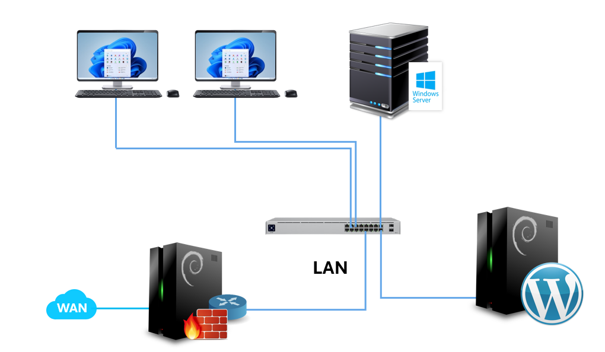

# projeto-infraestrutura-rede-senac
Projeto de infraestrutura de rede com Windows Server, Debian Firewall e servidor web WordPress no Senac Tatuape
Projeto acadêmico de implementação de rede corporativa.

## Infraestrutura

- Windows Server 2012 R2
- Debian Firewall
- Debian Web Server
- WordPress
- Clientes Windows 10

## Componentes

- Active Directory
- DNS
- DHCP
- Firewall NAT
- Servidor Web

## Diagrama da Rede

